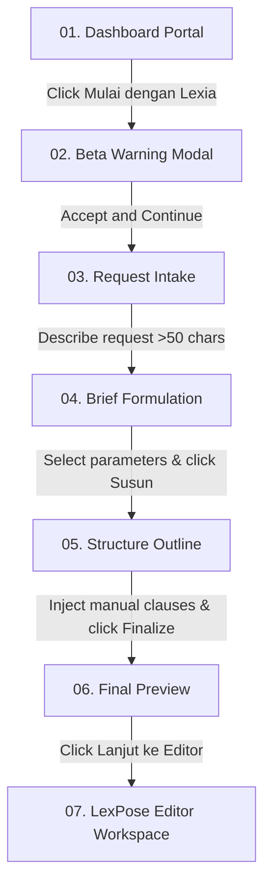

# 📖 Functional Specification: Lexia AI Drafting Module

**Author:** Antigravity AI Systems Architect  
**Project:** Lexpose Audit  
**Module:** AI Document Drafting (Lexia)  
**Status:** Verified End-to-End  

---

## 1. Functional Specification (Func Spec)

### Overview
Lexia is the artificial intelligence drafting companion within the Lexpose workspace. It accepts natural language request descriptions from operators, automatically determines the regulatory category, extracts and configures key components, and builds the structure outline before transitioning to the fully featured live editor workspace.

### Credit/Pricing Lifecycle (Two-Phase Commit)
To safeguard and charge operations fairly, credit deductions follow a two-phase reservation protocol:
1. **Base Cost Reservation:** Deducts **10 Credits** immediately upon request submission (`/deskripsi-permintaan`). This reserves the basic resources needed for semantic classification.
2. **Variable Cost Deduction:** Deducts a flat **5 Credits** (or per-clause variable fee) upon outline structure compilation approval (`/drafting-brief-normatif` -> `Susun`).

```
[Dashboard (503 Cr)] --(Kembangkan)--> [Reserve 10 Cr (493 Cr)] --(Susun)--> [Deduct 5 Cr (488 Cr)]
```

---

## 2. Step-by-Step Happy Flow & Visual Workflow

The workflow consists of six distinct stages:



### Flow Walkthrough
1. **Intake Gate:** The operator initiates the draft from the main dashboard.
2. **Consent warning:** Bypasses a Beta disclaimer stating AI limitations.
3. **Request Intake:** Accepts >50 characters of draft description (e.g. *Peraturan daerah tentang pengelolaan sampah rumah tangga dan limbah non-organik untuk mendorong warga memilah sampah dari sumber.*).
4. **AI Briefing (Classification):** Categorizes the request into a **Normative** or **Contractual** document. Operators select authority (radio button), applicable domains (checkboxes), and other metadata.
5. **Structure Outline:** Outlines chapters and articles. The operator manually inputs specific legal clauses into `Pasal 1` (General Provisions) to override automated LLM writing.
6. **Final Preview & Launch:** The final layout is generated with placeholders flagged. Bypassing metadata checks launches the document straight into the collaborative **LexPose Editor** workspace.

---

## 📊 3. Workflow Diagrams

*   **Interactive Flow Diagram:** [happy_flow_diagram.html](file:///home/backdoor/projects/lexpose-audit/docs/happy_flow_diagram.html)  
    *Generated via `archify` with inline SVG rendering and dual-theme capabilities.*
    *Accessible locally or online at `https://projects.lokalatdev.cloud/lexpose-audit/docs/happy_flow_diagram.html`*

---

## 🧪 4. Happy Flow Test Script

An automated regression testing script has been created to replicate this exact sequence using Chrome DevTools Protocol websockets and assertions.

*   **Test Script Path:** [test_lexpose_ai.py](file:///home/backdoor/projects/lexpose-audit/docs/test_lexpose_ai.py)

To execute the test script locally:
```bash
./venv/bin/python docs/test_lexpose_ai.py
```
